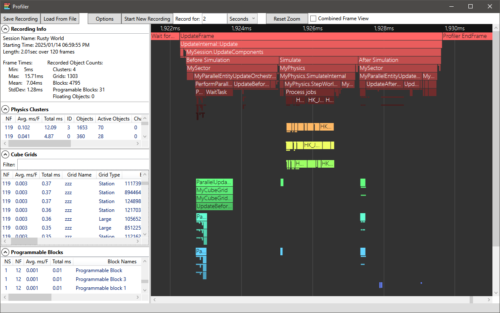

This is a profiling plugin for Space Engineers servers running with [Torch](https://torchapi.com).  
It features a visual timeline of captured timing events and detailed entity metrics to help diagnose performance issues.

This is an instrumentation profiler, each event has been manually patched into the game code. These patches do not cover everything in detail, more may be added in future versions.

## Usage Notes
The main profiler window is opened by the button in the "Visual Profiler" page in the Torch Plugins tab.  
Before beginning a capture, you may want to set some options. These are accessible from a dropdown after pressing the Options button.  
The different options are:

**- Profile Physics Clusters**  
When this is enabled the physics system will simulate each cluster serially instead of in parallel (each one is still multi-threaded). This is used to get accurate timings per-cluster. The times shown in the "Physics Clusters" section in the left pane should be ignored if this setting is not used. This setting does have a performance impact and is only active while a capture is being recorded.

**- Record Event Objects**  
When enabled, extra information is captured for some events. The main use for this is in capturing entity information. The "Physics Clusters", "Cube Grids" and "Programmable Blocks" sections in the left pane will not show any information unless this setting is enabled. *Note:* Processing the captured objects adds a sizable amount of extra time per frame which is shown in the graph. This cost is only incurred while recording.

**- Autosave Recording to File**  
When enabled, recorded captures are immediately saved to a file in "VisualProfiler/Recordings" in the "Instance" folder of your Torch server.

### Starting a recording
Profiling captures are done over a set fixed of time. To begin a capture, first choose from the dropdown whether you want to capture a specific number of seconds or a number simulation frames. There is a max limit of 60 seconds or 3600 frames. When a server is running slowly, frames may take longer to process than 1/60 seconds and so the number of captured frames vs seconds may not always match. A capture can be stopped early using the stop button.  
When capturing by frames, there is a maximum time cutoff of one minute. If that occurs, the amount of frames captured may be less than what is requested.

### Navigating

Once recording has completed, the UI will update to show all the information from the capture. The graph area shows a timeline of all the recorded events over the set duration. The different color hues represent different process threads. The graph can be zoomed in to a specific range by holding a Control key while clicking and dragging a region. For finer adjustment, you can zoom in/out by holding Control and using the mouse scrollwheel. It can also be panned left/right by holding Shift and scrolling, or by dragging the scroll bars.  
**Note:** When there are many frames/events captured, the UI may be slower to respond.  
Hovering the mouse over an event will show a tooltip with information including the time it took and how much memory was allocated in that time if any. It will also show information about an object that was captured for that event if any.

Occasionally some events may be much longer than they normally are. This is often due to .NET garbage collections (GCs). In places where one or more GCs have occurred during an event there will be a red triangle shown at the beginning or end of the event range. Hovering over the triangle will show how many GCs there were in that time.

When the "Combined Frame View" checkbox is ticked the graph view changes to show an aggregate view of all frames. The events shown are ordered based on their length which is the total accumulated time of all captured events. This view is useful for getting an overview of the largest time consumers.